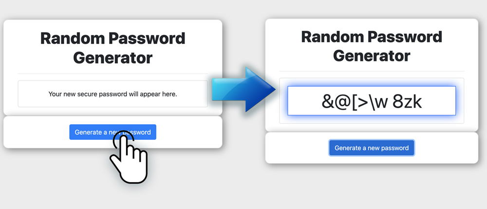

# Password Generator
An application that generates a random password based on user-selected criteria. This app runs in the browser and features dynamically updated HTML and CSS powered by JavaScript code. It also features a clean and polished user interface and is responsive, ensuring that it adapts to multiple screen sizes.

<a href="https://b0rgbart3.github.io/password-generator/">Live Demo</a><br>



## User Story

```
AS AN employee with access to sensitive data
I WANT to randomly generate a password that meets certain criteria
SO THAT I can create a strong password that provides greater security
```

### User Options

* Choose betwen 8 and 128 character length password
* Choose lowercase, uppercase, numeric, and/or special characters

### Validations

* User input for password length is validated to be only between 8 and 128 characters

Technologies | 
------------ 
* HTML 5 |
* CSS 3 |
* Bootstrap CDN |
* Javascript |


